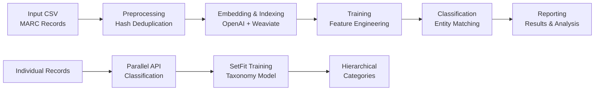

# Entity Resolution Pipeline for Yale University Library Catalog

A production-ready system for identifying and resolving person entities across MARC 21 library catalog records. The pipeline combines vector embeddings, feature engineering, and machine learning to achieve **99.55% precision** and **82.48% recall** on real library data.

## 🚀 Quick Start

### Prerequisites
- Python 3.10+
- Docker and Docker Compose (for Weaviate vector database)
- OpenAI API key (for embeddings)
- Anthropic API key (for individual record classification)

### Installation
```bash
# Clone and setup environment
git clone <repository-url>
cd entity_resolver
python -m venv venv
source venv/bin/activate  # On Windows: venv\Scripts\activate
pip install -r requirements.txt

# Configure API keys
echo "OPENAI_API_KEY=your_openai_api_key_here" > .env
echo "ANTHROPIC_API_KEY=your_anthropic_api_key_here" >> .env

# Start Weaviate vector database
docker-compose up -d weaviate
# Wait ~30 seconds for startup
curl http://localhost:8080/v1/.well-known/ready  # Check readiness
```

### Basic Usage
```bash
# Run complete pipeline
python main.py --config config.yml

# Run specific stages
python main.py --start preprocessing --end training

# Resume from last checkpoint
python main.py --resume

# Check pipeline status
python main.py --status
```

## 📊 Performance Overview

### Production Results (14,930 test pairs)
- **Precision**: 99.55% (extremely low false positive rate)
- **Recall**: 82.48% (captures majority of true matches)
- **F1-Score**: 90.22% (balanced performance)
- **Specificity**: 98.43% (excellent negative class accuracy)

### Computational Efficiency
- **99.23% reduction** in pairwise comparisons through vector similarity
- Processes 4,672 entities in 163 clusters with 83,921 comparisons
- Optimized for high-volume library catalog processing

## 🏗️ System Architecture

### Dual Classification Approach

The system implements two complementary classification pipelines:

1. **Main Entity Resolution Pipeline**: Identifies matching person entities across catalog records
2. **Individual Record Classification**: Classifies individual records into hierarchical taxonomy categories

### Core Pipeline Stages



### Technology Stack
- **Vector Database**: Weaviate with HNSW indexing
- **Embeddings**: OpenAI text-embedding-3-small (1536 dimensions)
- **ML Framework**: Custom logistic regression with gradient descent
- **Taxonomy Classification**: SetFit (Sentence Transformers + logistic head)
- **Parallel Processing**: asyncio/aiohttp for API rate limit optimization

## 📋 Data Flow & Processing

### Input Data Format
The pipeline processes CSV files extracted from Yale University Library's BIBFRAME catalog:

```csv
composite,person,roles,title,provision,subjects,personId,setfit_prediction,is_parent_category
"Contributor: Bach, Johann Sebastian, 1685-1750
Title: The Well-Tempered Clavier
Attribution: edited by Johann Sebastian Bach
Subjects: Keyboard music; Fugues
Provision information: Leipzig: Breitkopf & Härtel, 1985","Bach, Johann Sebastian, 1685-1750",Composer,The Well-Tempered Clavier,"Leipzig: Breitkopf & Härtel, 1985","Keyboard music; Fugues",12345#Agent700-1,Music and Sound Arts,FALSE
```

### Data Extraction Process
Pre-pipeline data preparation uses XQuery extraction from BIBFRAME catalog data:

- **Input**: BIBFRAME RDF/XML (converted from MARC21)
- **Processing**: Authority control, entity extraction, metadata assembly  
- **Output**: CSV datasets optimized for semantic embedding

## 🔧 Pipeline Stages Deep Dive

### 1. Preprocessing (`src/preprocessing.py`)
- **Purpose**: Clean and deduplicate input data
- **Key Operations**: 
  - MD5-based hash deduplication
  - String frequency analysis
  - Field mapping and lookup table creation
- **Output**: Hash mappings, string dictionaries, field relationships

### 2. Embedding & Indexing (`src/embedding_and_indexing.py`)
- **Purpose**: Generate vector embeddings and index in vector database
- **Features**:
  - OpenAI text-embedding-3-small (1536D) embeddings
  - Weaviate vector database with HNSW indexing
  - Batch processing with rate limiting and retry logic
- **Output**: Searchable vector index for similarity matching

### 3. Training (`src/training.py`)
- **Purpose**: Train logistic regression classifier on labeled entity pairs
- **Algorithm**: Custom gradient descent with L2 regularization
- **Features**: 5 engineered similarity features with domain-specific scaling
- **Configuration**: 
  - Learning rate: 0.01
  - Batch size: 256
  - Class weighting: 5:1 (positive:negative)
  - Early stopping with validation monitoring

### 4. Classification (`src/classifying.py`)
- **Purpose**: Apply trained model to identify entity matches
- **Features**:
  - Batch processing with configurable batch sizes
  - Transitive clustering for entity groups
  - Confidence scoring and threshold application
  - Memory management and telemetry collection

### 5. Reporting (`src/reporting.py`)
- **Purpose**: Generate comprehensive analysis and visualizations
- **Outputs**:
  - Interactive HTML dashboards
  - Detailed CSV exports with feature analysis
  - Performance visualizations (ROC curves, feature importance)
  - Error analysis and diagnostic reports

## 🎯 Feature Engineering System

### Active Features (5 total)
1. **person_cosine**: Cosine similarity between person name embeddings
2. **person_title_squared**: Squared person-title interaction term  
3. **composite_cosine**: Full record composite similarity
4. **taxonomy_dissimilarity**: SetFit domain classification differences
5. **birth_death_match**: Binary temporal matching with tolerance

### Feature Scaling Architecture
- **Feature Groups**: Domain-specific percentile normalization
  - Person features: 98th percentile scaling
  - Title features: 95th percentile scaling  
  - Context features: 90th percentile scaling
  - Binary features: Preserved as exact 0.0/1.0 values
- **Consistency**: Identical scaling between training and production

### Known Issues & Improvements
⚠️ **Analysis revealed that 2 of 5 features are currently inactive:**
- `taxonomy_dissimilarity`: Always returns 0.0 (should provide domain-based discrimination)
- `birth_death_match`: Always returns 0.0 (should catch temporal inconsistencies)

**Impact**: Pipeline achieves 99.55% precision with only 3 active features, suggesting significant improvement potential when inactive features are fixed.

## 🔄 Individual Record Classification

### Parallel Processing System
The system includes a separate pipeline for classifying individual catalog records:

```bash
# Parallel classification optimized for API rate limits
python scripts/verify_individual_classifications_parallel.py \
    --csv data/input/training_dataset.csv \
    --taxonomy data/input/revised_taxonomy_final.json \
    --output data/output/parallel_classifications.json \
    --concurrency 5 \
    --rate-limit-rpm 4000
```

### Features
- **Anthropic Claude API integration** with rate limiting
- **Token usage analysis** and automatic concurrency adjustment
- **Progress tracking** with detailed logging
- **Incremental saving** for long-running classifications
- **Error resilience** with retry logic and fallback handling

### SetFit Integration
Hierarchical taxonomy classification using SetFit models:

```bash
# Train SetFit classifier for domain categorization
python setfit/train_setfit_classifier.py \
    --csv_path data/input/training_dataset.csv \
    --ground_truth_path data/output/updated_identity_classification_map_v6_pruned.json \
    --output_dir ./setfit_model_output
```

## 🛠️ Configuration & Customization

### Main Configuration (`config.yml`)
```yaml
# Resource allocation
preprocessing_workers: 4
embedding_batch_size: 32
classification_workers: 8
classification_batch_size: 500

# OpenAI configuration
embedding_model: "text-embedding-3-small"
embedding_dimensions: 1536

# Enabled features
features:
  enabled: ["person_cosine", "person_title_squared", "composite_cosine",
           "taxonomy_dissimilarity", "birth_death_match"]
```

### Feature Configuration
Easily enable/disable features and adjust parameters:
```yaml
features:
  parameters:
    person_cosine:
      weight: 1.0
      fallback_value: 0.5
    birth_death_match:
      tolerance: 2
      weight: 1.0
```

### Scaling Configuration (`scaling_config.yml`)
```yaml
feature_groups:
  person_features: ["person_cosine"]        # 98th percentile
  title_features: ["person_title_squared"]  # 95th percentile  
  context_features: ["composite_cosine"]    # 90th percentile
  binary_features: ["birth_death_match"]    # No scaling
```

## 🔍 Production Features

### Checkpoint & Resumption System
- **Complete state persistence** for all pipeline stages
- **Resumption capability**: Continue from any point of failure
- **Selective reset**: Reset and re-run specific stages only

```bash
# Resume from last successful checkpoint
python main.py --resume

# Check current pipeline status
python main.py --status

# Reset specific stages and continue
python main.py --reset training classifying --start training
```

### Error Resilience & Monitoring
- **Comprehensive exception handling** with graceful degradation
- **Retry logic** with exponential backoff (using Tenacity library)
- **Memory usage monitoring** and garbage collection
- **Detailed telemetry** collection and performance metrics
- **Transaction ID tracking** for multi-threaded debugging

### Performance Optimization
- **Batch processing** with configurable worker allocation
- **Vector similarity optimization** reducing comparisons by 99.23%
- **Connection pooling** for vector database operations
- **Progressive candidate retrieval** for large datasets

## 📈 Results & Analysis

### Test Results Analysis
Recent analysis of false positive patterns reveals:
- **Primary cause**: Very similar person names (high cosine similarity)
- **Secondary factor**: Similar composite text content
- **Confidence range**: 87.02% - 92.02% for false positives
- **Improvement opportunity**: Activating taxonomy and temporal features

### Visualization & Reporting
The system generates comprehensive analysis including:
- **Interactive HTML dashboards** with parameter correlation analysis
- **Feature importance visualizations** using actual model weights
- **ROC/PR curves** for individual feature performance
- **Confusion matrices** with detailed classification metrics
- **Error pattern analysis** for systematic improvement

### Performance Metrics
```
Precision: 99.55% (9,955 TP, 45 FP)
Recall: 82.48% (2,114 FN, 9,955 TP)  
F1-Score: 90.22%
Accuracy: 85.54%
Specificity: 98.43%
```

## 🚀 Advanced Usage

### Docker Deployment
```bash
# Complete Docker setup
docker-compose up -d weaviate
docker build -t entity-resolver .
docker run --rm --network host \
  -v $(pwd)/data:/app/data \
  -v $(pwd)/config.yml:/app/config.yml \
  --env-file .env \
  entity-resolver python main.py --config config.yml
```

### Custom Feature Development
Add new features by implementing the feature interface:

```python
# In src/custom_features.py
def register_custom_features(feature_engineering, config):
    feature_engineering.register_feature('my_feature', my_feature_func)

# Enable in config.yml
features:
  enabled: [..., "my_feature"]
```

### Performance Tuning
Optimize for your hardware and dataset:

```yaml
# Batch processing optimization
embedding_batch_size: 32     # Adjust based on API limits
classification_batch_size: 500  # Adjust based on memory

# Weaviate optimization  
weaviate_ef: 128            # Higher = better search quality
weaviate_max_connections: 64 # Higher = more connected graph
```

## 🔧 Troubleshooting

### Common Issues

**Weaviate Connection Problems**:
```bash
# Check Weaviate status
docker-compose ps
docker-compose logs weaviate
curl http://localhost:8080/v1/.well-known/ready
```

**API Rate Limiting**:
- Monitor API usage in provider dashboards
- Adjust concurrency settings in configuration
- Use `--dry-run` flag for testing without API calls

**Memory Issues**:
- Reduce batch sizes in configuration
- Increase Docker memory limits
- Monitor with `python main.py --status`

**Pipeline Failures**:
- Check logs in `data/logs/pipeline.log`
- Use stage-specific execution: `--start <stage> --end <stage>`
- Enable debug logging: Set `log_level: DEBUG` in config

### Performance Optimization Tips

1. **Batch Size Tuning**: Balance API limits vs. throughput
2. **Worker Allocation**: Match CPU cores for optimal parallelization  
3. **Vector Database**: Tune HNSW parameters for your data characteristics
4. **Memory Management**: Configure garbage collection for long-running processes

## 📚 Documentation

### Additional Resources
- **[project_structure.md](project_structure.md)**: Detailed project structure and file organization
- **[setfit/SETFIT_README.md](setfit/SETFIT_README.md)**: SetFit taxonomy classification system
- **[CLAUDE.md](CLAUDE.md)**: Project instructions and dataset structure
- **Performance Reports**: Interactive HTML dashboards in `data/output/reports/`

### API Reference
Key classes and their responsibilities:
- `PipelineOrchestrator`: Main pipeline coordination and stage management
- `FeatureEngineering`: Feature calculation with caching and versioning
- `EntityClassifier`: Logistic regression training with gradient descent
- `EntityClassification`: Entity matching and transitive clustering
- `ScalingBridge`: Feature scaling coordination across environments

## 🤝 Contributing

### Development Workflow
1. **Setup**: Follow installation instructions with development dependencies
2. **Testing**: Use small test datasets for feature development
3. **Documentation**: Update relevant documentation for any changes
4. **Performance**: Run full pipeline tests before major changes

### Code Standards
- Follow existing code patterns and documentation styles
- Implement comprehensive error handling and logging
- Include performance considerations for large-scale processing
- Maintain backward compatibility for configuration files

## 📄 License

[License information to be added]

## 📞 Support & Contact

**Issues**: Report bugs and feature requests via GitHub issues  
**Documentation**: See additional documentation in the `/docs` directory  
**Performance**: Use built-in telemetry and reporting for optimization guidance

---

**Project Status**: Production-ready entity resolution system with comprehensive tooling for analysis, debugging, and performance optimization.

**Last Updated**: June 2025